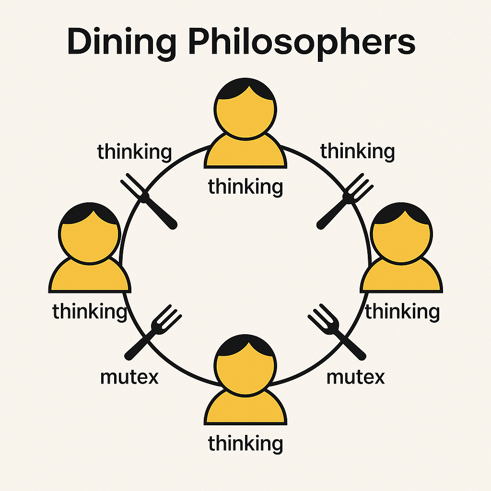

# Philosophers (Multithreading Edition)

<p align="center">
  
</p>

## 📌 Project Description

**Dining Philosophers** is a classic synchronization problem that illustrates challenges in multithreading, mutual exclusion, and deadlock prevention. The goal is to simulate a number of philosophers who alternately **think**, **eat**, and **sleep**, while sharing limited resources — **forks**.

---

## 🧵 Multithreading

Each philosopher is implemented as a **separate thread** (or **process** in the bonus part).

- The main thread initializes the simulation and starts philosopher threads.
- Each philosopher thread handles its own behavior independently.

---

## 🛡️ Synchronization: Mutexes and Semaphores

### ➤ Mandatory part (threads + mutexes)

- Uses `pthread_mutex_t` to manage access to forks.
- One mutex per fork.
- Additional mutexes are used to safely print messages and track the last time each philosopher ate.

### ➤ Bonus part (processes + semaphores)

- Uses **POSIX semaphores** (`sem_open`, `sem_wait`, `sem_post`) for:
  - managing access to forks (typically a single semaphore with the number of forks);
  - synchronized printing;
  - tracking how many times each philosopher has eaten;
  - detecting if a philosopher has died.

---

## 🔄 Philosopher Lifecycle

Each philosopher continuously performs the following steps:

1. **Take two forks** (lock resources)
2. **Eat** (for a set time)
3. **Release forks**
4. **Sleep** (rest)
5. **Think** (prepare to eat again)

---

## ☠️ Termination Conditions

- If a philosopher does not eat within `time_to_die`, the monitoring thread detects it and ends the simulation.
- If each philosopher eats the required number of times, the simulation ends with a message:  
  **`Dinner is over 🎉`**

---

## 🛠️ Compilation

```bash
make
